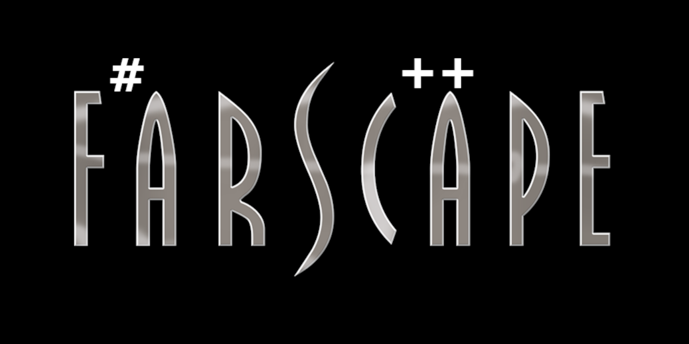

# Farscape: F# Native Library Binding Generator

[](https://opensource.org/licenses/MIT)

Farscape is a command-line tool that aims to automatically generate idiomatic F# bindings for C++ libraries, preserving F# intrinsics. It leverages LibClang through CppSHarp to parse C++ headers and produces F# code that can be directly used in both native and .NET based F# applications (and we have plans to eventually support C#/.NET as well through fluent API bindings).

<table>
  <tr>
    <td align="center" width="100%">
      <strong>⚠️ Caution: Experimental ⚠️</strong><br>
      This project is in early development and not ready for production use.
    </td>
  </tr>
</table>

## Features

- **C++ Header Parsing**: Uses CppSharp/LibClang to accurately parse C++ header files
- **Idiomatic F# Code Generation**: Generates clean, idiomatic F# code
- **P/Invoke Support**: Automatically creates proper P/Invoke declarations for native functions
- **Type Mapping**: Smart mapping between C++ and F# types
- **Project Generation**: Creates complete F# projects ready for building
- **Documentation**: Preserves C++ documentation as F# XML docs

---

---
### Current Implementation

We've successfully created a working implementation for cJSON.h that:
- Manually extracts function declarations, structs, and type definitions
- Generates appropriate P/Invoke declarations with correct calling conventions
- Maps C++ types to their F# equivalents (though with some conversion issues like char* → byte)
- Produces usable bindings that can be incorporated into F# projects

The current solution is intentionally focused on cJSON as a proof of concept, with a simplified approach.

### Generalization Requirements

To fulfill Farscape's vision of supporting any C++ library, the implementation needs to be generalized:

1. **Create a robust header parsing system**:
    - Enhance or replace CppSharp integration for reliable header parsing
    - Support standard C/C++ constructs across various library styles
    - Handle platform-specific details and preprocessor directives

2. **Improve type mapping**:
    - Refine string handling (currently mapping to byte instead of proper string marshaling)
    - Better support for complex types, structs, and templates
    - Handle function pointers and callbacks correctly

3. **Support diverse library patterns**:
    - Handle C-style libraries like cJSON
    - Support C++ classes and object-oriented patterns
    - Accommodate different calling conventions and export styles

4. **Generate idiomatic F# code**:
    - Create proper F# modules and types that mirror C++ namespaces
    - Generate helpful documentation from header comments
    - Produce wrapper types that provide memory safety

The existing manual approach for cJSON demonstrates the feasibility of this vision, and serves as a template for generalization to other libraries.

### Path Forward

Build upon the current foundation by systematically expanding support for different C++ features and header patterns, starting with basic C-style libraries and progressively adding support for more complex C++ constructs.

___

---

## Prerequisites

- [.NET 9.0 SDK](https://dotnet.microsoft.com/download/dotnet/9.0) or later
- [LLVM/Clang](https://releases.llvm.org/download.html) with development components (for LibClang)

## Installation

### From Source

```bash
# Clone the repository
git clone https://github.com/yourusername/farscape.git
cd farscape

# Build the project
./build.ps1

# Install as a global tool
dotnet tool install --global --add-source ./src/Farscape.Cli/nupkg farscape
```

## Usage

```bash
# Basic usage
farscape --header path/to/header.h --library libname

# With additional options
farscape --header path/to/header.h \
         --library libname \
         --output ./output \
         --namespace MyProject.Bindings \
         --include-paths /usr/include,/usr/local/include \
         --verbose
```

### Command Line Options

| Option | Description |
|--------|-------------|
| `--header`, `-h` | Path to the C++ header file (required) |
| `--library`, `-l` | Name of the native library to bind to (required) |
| `--output`, `-o` | Output directory for the generated F# project (default: ./output) |
| `--namespace`, `-n` | Namespace prefix for the generated F# code (default: NativeBindings) |
| `--include-paths`, `-i` | Additional include paths for C++ header parsing (comma separated) |
| `--verbose`, `-v` | Enable verbose output |

## Examples

### Basic Example

Assume you have a simple C library with a header like this:

```c
// math_lib.h
#pragma once

#ifdef __cplusplus
extern "C" {
#endif

// Adds two integers
int add(int a, int b);

// Multiplies two doubles
double multiply(double a, double b);

#ifdef __cplusplus
}
#endif
```

Generate F# bindings with:

```bash
farscape --header math_lib.h --library mathlib
```

The generated F# code will look like:

```fsharp
namespace NativeBindings

open System
open System.Runtime.InteropServices

module NativeBindings =
    /// <summary>
    /// Adds two integers
    /// </summary>
    [<DllImport("mathlib", CallingConvention = CallingConvention.Cdecl)>]
    extern int add(int a, int b)
    
    /// <summary>
    /// Multiplies two doubles
    /// </summary>
    [<DllImport("mathlib", CallingConvention = CallingConvention.Cdecl)>]
    extern double multiply(double a, double b)
```

### Complex Example

Farscape can handle more complex scenarios including:

- Classes and structs
- Enums
- Templates (with limitations)
- Namespaces
- Function pointers
- Various calling conventions

## Advanced Topics

### Self-Hosting

Farscape will eventually be used to generate F# bindings for LibClang itself, creating a self-hosting cycle.

### MLIR/LLVM Integration

The architecture is designed to potentially support MLIR/LLVM lowering in the future, enabling compilation to native code without the .NET runtime.

### Delegate Pointer Handling

Special handling for C++ function pointers and delegates will be included, with support for marshaling between F# functions and C++ callbacks.

## Contributing

Contributions are welcome! Please feel free to submit a Pull Request.

1. Fork the repository
2. Create your feature branch (`git checkout -b feature/amazing-feature`)
3. Commit your changes (`git commit -m 'Add some amazing feature'`)
4. Push to the branch (`git push origin feature/amazing-feature`)
5. Open a Pull Request

## License

This project is licensed under the MIT License - see the LICENSE file for details.

## Acknowledgments

- [CppSharp](https://github.com/mono/CppSharp) for its deep coverage of LibClang
- [LLVM/Clang](https://llvm.org/) project for LibClang
- F# community for inspiration and support
- .NET runtime for P/Invoke support
